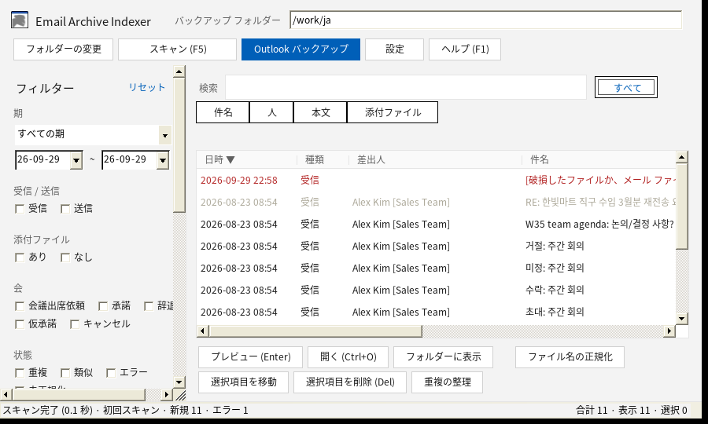

# Email Archive Indexer

[English](README.md) · [한국어](README.ko.md) · [Español](README.es.md) · [Français](README.fr.md) · **日本語** · [简体中文](README.zh.md)

メールを `.msg` / `.eml` ファイルとして保存している方のための、インストール不要の Windows プログラムです。約 10,000 ファイルまでのバックアップ フォルダーから目的のメールを数秒で見つけ、ファイル名を統一し、重複を整理し、Outlook (クラシック) の受信トレイと送信済みアイテムを自動的にバックアップします。

1 つの `.exe` ファイルだけで動作し、インストール、管理者権限、インターネット接続は不要です。



*スクリーンショットは Linux 上の Mono でサンプル データを使って撮影したものです。実際の Windows での表示とは多少異なります。*

## 機能

- **高速検索**: 件名、人 (差出人/宛先/CC)、本文、添付ファイル名を対象に検索します。複数の語を入力するとすべてを含むメールに一致し、`"引用符"` で囲むと完全一致の語句で検索します。
- **フィルター**: 日付、受信/送信、添付ファイル、会議の返信 (会議出席依頼/承諾/辞退/仮承諾/キャンセル)、重複、類似メール、読み取りエラー、フォルダー、上位の差出人で絞り込めます。
- **プレビュー**: 書式付き表示またはテキスト表示で確認できます。外部画像、スクリプト、リダイレクトはブロックされ、リンクは開く前に確認します。Ctrl+O でメールを Outlook で開けます。
- **ファイル名の正規化**: `YYMMDD_HHMMSS_差出人_件名_添付有.msg` の形式に統一します。受信メールは受信日時、送信メールは送信日時を使います。事前に変更前/変更後のプレビューを確認でき、元に戻すこともできます。
- **重複**: フォルダーに追加された完全に同一のコピーは自動的にごみ箱に移動します (初回スキャンでは行いません)。それ以外は、案内に沿った整理で処理できます。完全に削除されることはありません。
- **Outlook (クラシック) のバックアップ**: 受信トレイと送信済みアイテムを `.msg` として保存します。既にバックアップ済みのメールはスキップし、Outlook 側には一切変更を加えず、成功と失敗をすべてログに記録します。Outlook が起動していない場合は起動します。
- **増分スキャン**: 小さなローカル キャッシュを使い、初回スキャン以降は変更されたファイルだけを読み込みます。
- **6 言語**: English、한국어、Español、Français、日本語、简体中文 (設定 → Language / 언어)。

## ダウンロードと実行

1. [Releases](https://github.com/mixqz/msg_indexer/releases) から `EmailIndexer-v<version>.zip` をダウンロードして展開します。
2. `EmailIndexer.exe` をダブルクリックします。このアプリにはコード署名がないため、**「Windows によって PC が保護されました」** と表示される場合があります。**詳細情報** → **実行** を選択するか、ファイルを右クリック → **プロパティ** → **許可する** をチェックします。
3. **フォルダーの変更** をクリックし、メールのバックアップ フォルダーを選択します。

動作環境: Windows 11 (動作確認済み) または Windows 10 と .NET Framework 4.8 (Windows に標準で含まれています)。Outlook のバックアップには Outlook (クラシック) が必要です。新しい Outlook には自動化インターフェイスがありません。

ユーザー ガイド: [English](docs/guide/USER_GUIDE.en.md) · [한국어](docs/guide/USER_GUIDE.ko.md) · [Español](docs/guide/USER_GUIDE.es.md) · [Français](docs/guide/USER_GUIDE.fr.md) · [日本語](docs/guide/USER_GUIDE.ja.md) · [简体中文](docs/guide/USER_GUIDE.zh.md)

## プライバシー

すべてのデータは PC 内に留まります。アプリはネットワーク接続を一切行いません。キャッシュとログは、バックアップ フォルダー内の隠しフォルダー `.emailindex` と `%APPDATA%\EmailIndexer` に保存されます。

## ソースからのビルド

必要なのは Docker だけです。ホストには何もインストールされません。

```bash
./build.sh          # tests + Windows exe → dist/EmailIndexer.exe
./build.sh test     # core tests only
python3 package.py  # release zip → dist/EmailIndexer-v<version>.zip (+ .sha256)
```

- `src/EmailIndexer.Core`: メールの解析、キャッシュ、重複、ファイル名の規則、翻訳 (netstandard2.0、Docker でテスト)
- `src/EmailIndexer.App`: WinForms UI と Outlook COM (.NET Framework 4.8、単一の exe に統合)
- `tests/EmailIndexer.Core.Tests`: xUnit テスト
- バージョン: `src/EmailIndexer.Core/AppInfo.cs`、`src/EmailIndexer.App/EmailIndexer.App.csproj`、`src/EmailIndexer.App/app.manifest` を同時に更新します。
- 診断: `EmailIndexer.exe --scan-test <folder>` (読み取り専用の解析レポート) と `--index-test <folder>` (キャッシュと重複のレポート。何も削除しません)。

## 貢献

翻訳の修正や新しい言語の追加を歓迎します。翻訳は AI の支援を受けて作成したもので、まだネイティブ スピーカーによるレビューを受けていません。[CONTRIBUTING.md](CONTRIBUTING.md) を参照してください。

## ライセンス

[MIT](LICENSE)。サードパーティ製コンポーネントは [THIRD-PARTY-NOTICES.md](THIRD-PARTY-NOTICES.md) に記載しています。
