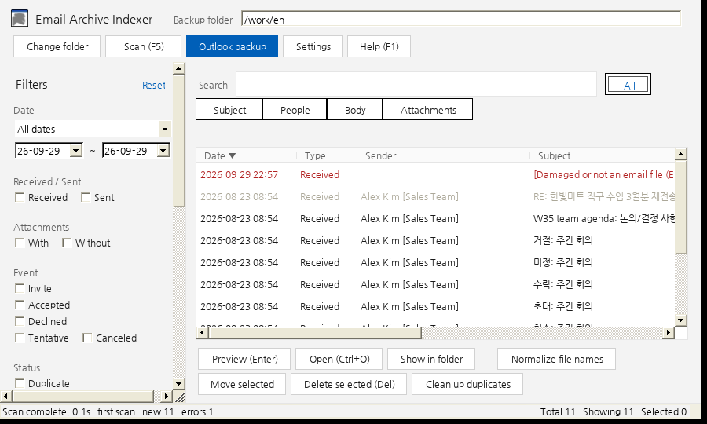

# Email Archive Indexer

[English](README.md) · [한국어](README.ko.md) · [Español](README.es.md) · [Français](README.fr.md) · [日本語](README.ja.md) · **简体中文**

一款适合将邮件保存为 `.msg` / `.eml` 文件的用户使用的 Windows 便携程序。在最多约 10,000 个文件的备份文件夹中，几秒钟即可找到任意邮件；它还能为文件统一命名、清理重复项，并自动备份 Outlook (经典版) 的收件箱和已发送邮件。

只有一个 `.exe` 文件，无需安装，无需管理员权限，无需连接互联网。



*屏幕截图使用示例数据在 Linux 的 Mono 下拍摄；实际 Windows 中的外观略有不同。*

## 功能

- **快速搜索**：可搜索主题、相关人员（发件人/收件人/抄送）、正文和附件名称。输入多个词时须全部匹配；使用 `"引号"` 可精确匹配短语。
- **筛选**：日期、收到/发出、附件、会议响应（会议邀请/已接受/已拒绝/暂定/已取消）、重复、相似邮件、读取错误、文件夹、常用发件人。
- **预览**：支持格式视图和文本视图。外部图片、脚本和重定向均被阻止，打开链接前会先询问你。按 Ctrl+O 可在 Outlook 中打开邮件。
- **规范化文件名**：统一为 `YYMMDD_HHMMSS_发件人_主题_有附件.msg`，收到的邮件使用接收时间，发出的邮件使用发送时间。运行前会先显示更改前/更改后的预览，并且可以撤销。
- **重复项**：添加到文件夹中的完全相同的副本会自动移到回收站（首次扫描时绝不会这样做）。其余重复项可通过引导式清理处理。任何内容都不会被永久删除。
- **Outlook (经典版) 备份**：将收件箱和已发送邮件保存为 `.msg`，跳过已备份的邮件，不更改 Outlook 中的任何内容，并记录每次成功和失败。如果 Outlook 未运行，会自动启动它。
- **增量扫描**：借助小型本地缓存，首次扫描后只读取有更改的文件。
- **6 种语言**：English、한국어、Español、Français、日本語、简体中文（Settings → Language / 언어）。

## 下载并运行

1. 从 [Releases](https://github.com/mixqz/msg_indexer/releases) 下载 `EmailIndexer-v<version>.zip` 并解压。
2. 双击 `EmailIndexer.exe`。由于应用未进行代码签名，Windows 可能会显示 **“Windows 已保护你的电脑”**。请选择 **更多信息 → 仍要运行**，或右键单击该文件 → **属性** → **解除锁定**。
3. 单击 **更改文件夹**，选择邮件备份文件夹。

系统要求：Windows 11（已测试）或装有 .NET Framework 4.8 的 Windows 10（Windows 已自带）。Outlook 备份需要 Outlook (经典版)；新版 Outlook 不提供自动化接口。

用户指南：[English](docs/guide/USER_GUIDE.en.md) · [한국어](docs/guide/USER_GUIDE.ko.md) · [Español](docs/guide/USER_GUIDE.es.md) · [Français](docs/guide/USER_GUIDE.fr.md) · [日本語](docs/guide/USER_GUIDE.ja.md) · [简体中文](docs/guide/USER_GUIDE.zh.md)

## 隐私

所有数据都保留在你的电脑上。应用不建立任何网络连接。其缓存和日志文件位于备份文件夹内的隐藏文件夹 `.emailindex` 以及 `%APPDATA%\EmailIndexer` 中。

## 从源代码构建

只需要 Docker；不会在主机上安装任何内容。

```bash
./build.sh          # tests + Windows exe → dist/EmailIndexer.exe
./build.sh test     # core tests only
python3 package.py  # release zip → dist/EmailIndexer-v<version>.zip (+ .sha256)
```

- `src/EmailIndexer.Core`：邮件解析、缓存、重复项、文件名规则、翻译 (netstandard2.0，在 Docker 中测试)
- `src/EmailIndexer.App`：WinForms 界面和 Outlook COM (.NET Framework 4.8，合并为单个 exe)
- `tests/EmailIndexer.Core.Tests`：xUnit 测试
- 版本：请同时更新 `src/EmailIndexer.Core/AppInfo.cs`、`src/EmailIndexer.App/EmailIndexer.App.csproj` 和 `src/EmailIndexer.App/app.manifest`。
- 诊断：`EmailIndexer.exe --scan-test <folder>`（只读的解析报告）和 `--index-test <folder>`（缓存和重复项报告，不删除任何内容）。

## 参与贡献

非常欢迎改进翻译或添加新语言；这些翻译是在 AI 辅助下完成的，尚未经过母语人士审阅。请参阅 [CONTRIBUTING.md](CONTRIBUTING.md)。

## 许可证

[MIT](LICENSE)。第三方组件列在 [THIRD-PARTY-NOTICES.md](THIRD-PARTY-NOTICES.md) 中。
